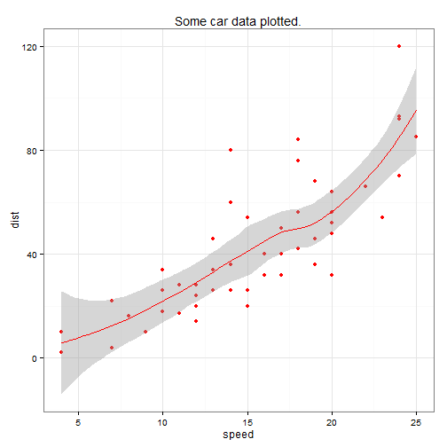
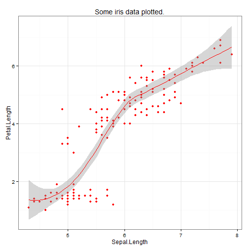

ESM 505/ESR 605 : Data Management, Spring 2014

Module 10: Writing functions 
====================

One of the basic building blocks of R programming are functions. Normally we just use someone else's prewritten function, but we can write our own.  This is particularly useful when you find yourself repeating yourself and would like to create a shortcut.


myfunction <- function(arg1, arg2, ...){
  statements
  return(object)
}


For example, here is a simple "hello world" function that doesn't take any arguements and simply returns "Hello world!" when you call it.


```r
# the function itself
hello <- function() {
    msg <- "Hello world!"
    return(msg)
}

# calling the hello() function

hello()
```

```
## [1] "Hello world!"
```


Let's modify the function to accept an argument.  In this case, a name.


```r
# the function itself
hello <- function(name) {
    msg <- paste("Hello ", name, "!", sep = "")
    return(msg)
}

# passing a name to the hello() function

hello("Brian")
```

```
## [1] "Hello Brian!"
```


If you want, you can specify default values for your expected input.  This is a good way to 


```r
hello <- function(name = "John Smith") {
    msg <- paste("Hello ", name, "!", sep = "")
    return(msg)
}

hello()
```

```
## [1] "Hello John Smith!"
```

```r

# but this still works if you provide a name

hello("Brian")
```

```
## [1] "Hello Brian!"
```


We can add a second argument and some logic


```r
# the function itself
hello <- function(name, gender) {
    
    # modify greeting based on gender
    if (gender == "F") {
        formal <- " ma'am"
    }
    if (gender == "M") {
        formal <- " sir"
    }
    if (gender != "F" & gender != "M") {
        formal <- ""
    }
    
    # modify greeting based on time of day
    hour <- as.numeric(format(Sys.time(), "%H"))
    
    if (hour > 0 & hour < 12) {
        daypart <- " morning"
    }
    
    if (hour >= 12 & hour < 18) {
        daypart <- " afternoon"
    }
    
    if (hour >= 18) {
        daypart <- " evening"
    }
    
    
    msg <- paste("Hello ", name, "! Nice to see you this", daypart, formal, 
        ".", sep = "")
    return(msg)
}

# passing a name and gender to the hello() function

hello("Brian", "M")
```

```
## [1] "Hello Brian! Nice to see you this morning sir."
```

```r
hello("Amy", "F")
```

```
## [1] "Hello Amy! Nice to see you this morning ma'am."
```

```r
hello("Chris", "?")
```

```
## [1] "Hello Chris! Nice to see you this morning."
```


Of course you can do some math in a function


```r

BMI <- function(weight_lbs, height_inches) {
    
    BMI <- weight_lbs * 703/(height_inches)^2
    return(BMI)
}

BMI(185, 72)
```

```
## [1] 25.09
```


Let's take a look at some very basic statistics in R.


```r
x <- c(1, 2, 3, 2, 1, 2, 3, 2, 3, 4, 5, 3, 3, 2, 1)
mean(x)
```

```
## [1] 2.467
```

```r
sd(x)
```

```
## [1] 1.125
```

```r
length(x)
```

```
## [1] 15
```

```r
se(x)
```

```
## Error: could not find function "se"
```


Oops, there wasn't a function named "se".  We could search around for one and possibly find one in a package somewhere, but there just ins't a standard error function in base R. 

Standard errors are pretty straight forward so let's write our own function called "se".


```r
se <- function(x) {
    se <- sd(x)/sqrt(length(x))
    return(se)
}

se(x)
```

```
## [1] 0.2906
```


Great we have a standard error function now.  But what happens if we have an NA in our data.


```r
x <- c(12, 23, 41, 23, 19, 16, NA)
se(x)
```

```
## [1] NA
```

Not so good.


```r
se <- function(x) {
    x <- x[!is.na(x)]
    se <- sd(x)/sqrt(length(x))
    return(se)
}

se(x)
```

```
## [1] 4.112
```

 
That's better.  But what if you want "na.rm = TRUE" to be an option?  After all, this is how many of R's own basic functions (mean(), var(), sd(), etc..) work.  Just add "na.rm" as another input variable and set it to FALSE by defualt.  Then we'll use an if statement to take care of the logic and remove na's from the input if "na.rm = TRUE".


```r
se <- function(x, na.rm = FALSE) {
    if (na.rm == TRUE) {
        x <- x[!is.na(x)]
    }
    se <- sd(x)/sqrt(length(x))
    return(se)
}

se(x)
```

```
## [1] NA
```

```r

se(x, na.rm = TRUE)
```

```
## [1] 4.112
```


We can also create functions to do complex tasks like make plots that are formatted just the way we like them.


```r

myFavPlot <- function(dat, x, y, title) {
    require(ggplot2)
    p <- ggplot(data = dat, aes_string(x = x, y = y))
    p <- p + geom_point(color = "red") + stat_smooth(color = "red")
    p <- p + theme_bw()
    p <- p + labs(title = title)
    print(p)
}

myFavPlot(cars, "speed", "dist", "Some car data plotted.")
```

```
## Loading required package: ggplot2
## geom_smooth: method="auto" and size of largest group is <1000, so using loess. Use 'method = x' to change the smoothing method.
```

 

```r
myFavPlot(iris, "Sepal.Length", "Petal.Length", "Some iris data plotted.")
```

```
## geom_smooth: method="auto" and size of largest group is <1000, so using loess. Use 'method = x' to change the smoothing method.
```

 


A couple things to point out about this last plotting function. 

1.) I used "require" instead of "library" to call the ggplot2 package within the function.  Require function is more useful for error trapping because it returns a logical value by default.

2.) I used "aes_string" instead of "aes" in my ggplot call.  The names of the fields being passed are strings and not objects.

## Where to keep your functions

If you have just one or two functions, go ahead an put them in at the top of your R script.  If you have many functions, create a new R script just for you functions and then source that script in at the top of any R script if you need those functions.


## Homework

Create two working functions (preferably ones that actually will help you with your data analysis) and upload your functions as an R script to the homework dropbox.
