ESM 505/ESR 605 : Data Management, Spring 2014

Module 13: Mapping in R 
====================

There are a lot of ways to create maps in R.  In fact, there are many different packages to choose from when it comes to making maps.  In this module, I will cover some of the basics with a few packages to give you an overview of the options.

There are also lots of tutorials online if you want more information.

* http://statacumen.com/teach/SC1/SC1_16_Maps.pdf
* https://github.com/hadley/ggplot2/wiki/plotting-polygon-shapefiles
* http://cran.r-project.org/web/views/Spatial.html
* http://www.molecularecologist.com/2012/09/making-maps-with-r/
* http://cameron.bracken.bz/finally-an-easy-way-to-fix-the-horizontal-lines-in-ggplot2-maps
* http://rpubs.com/alobo/getmapCRS


## Large scale maps with polical boudaries (world, countries, counties)

Sometimes you want a very simple clean map with just a few polical boundries.   This is particularly useful for maps on a large scale (the world, the state, the county) to show where your study site is, but it's not so good if you want to show your particular sampling locations around a small pond.


### Simple maps using "maps" package

The simplist way to make a map is using the map() function in the "maps" package.  This package comes with map data for the countries of the world, US states, US counties, and a select few other country maps.


```r
library(maps)
# simple map of the world
map("world")

# add a point (roughly portland)
pdx_lat <- 45.52
pdx_lon <- -122.68
points(pdx_lon, pdx_lat, col = "red", pch = 20, cex = 1)
```

 

```r

# If you want, you can zoom into the map by altering the xlim and ylim.
# Let's zooom in to the Pacific Northwest.
map("world", xlim = c(-130, -115), ylim = c(40, 50))
```

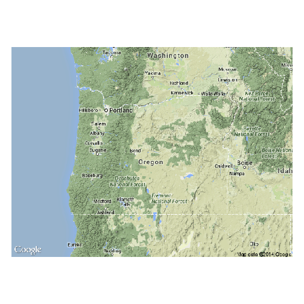 

```r

# Yick, the resolution isn't so hot.  Let's try using the state level maps.
map("state", region = c("Washington", "Oregon"))

# Add a point for Portland.
points(pdx_lon, pdx_lat, col = "red", pch = 20, cex = 3)

# Now let's add the counties to Oregon
map("county", "Oregon", add = T)
```

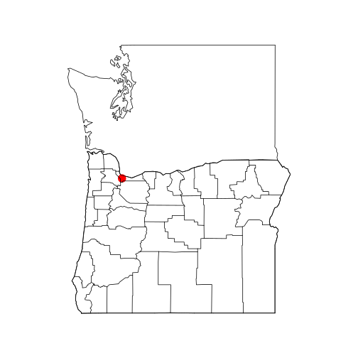 


## Plotting Shapefiles

If you want to move beyond the limits of the maps packacke you'll want to be able to plot shapefiles.  If you are familiar with GIS you probably know what those are.  If not, just think of them as vectorized map files.

### Plotting a shapefile using "maptools" package


```r
library(maptools)
```

```
## Loading required package: sp
## Checking rgeos availability: FALSE
##  	Note: when rgeos is not available, polygon geometry 	computations in maptools depend on gpclib,
##  	which has a restricted licence. It is disabled by default;
##  	to enable gpclib, type gpclibPermit()
```

```r
## use readShapePoly to read a polygon shapefile.  Use readShapeLine for a
## line shapefile and readShapePoint for a points shapefile

# Countries of the world shapefile
countries <- readShapePoly("~/Geoprocessing_Shapefiles/Countries.shp")
# Marine Ecoregions of the World
MEOW <- readShapePoly("~/Geoprocessing_Shapefiles/meow_ecos.shp")

plot(MEOW, col = "light blue")
plot(countries, col = "gray", add = T)
```

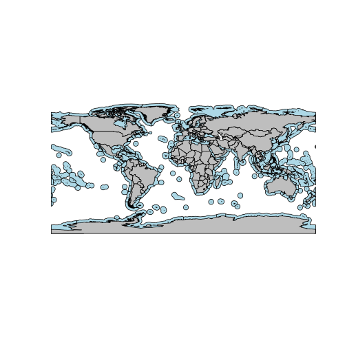 


### Plotting a shapefile using the "rgdal" package


```r

library(rgdal)
```

```
## rgdal: version: 0.8-16, (SVN revision 498)
## Geospatial Data Abstraction Library extensions to R successfully loaded
## Loaded GDAL runtime: GDAL 1.9.0, released 2011/12/29
## Path to GDAL shared files: /usr/share/gdal/1.9
## Loaded PROJ.4 runtime: Rel. 4.8.0, 6 March 2012, [PJ_VERSION: 480]
## Path to PROJ.4 shared files: (autodetected)
```

```r
dsn <- path.expand("~/Geoprocessing_Shapefiles")
countries2 <- readOGR(dsn, "Countries")
```

```
## OGR data source with driver: ESRI Shapefile 
## Source: "/home/stevesb/Geoprocessing_Shapefiles", layer: "Countries"
## with 250 features and 8 fields
## Feature type: wkbPolygon with 2 dimensions
```

```r
MEOW2 <- readOGR(dsn, "meow_ecos")
```

```
## OGR data source with driver: ESRI Shapefile 
## Source: "/home/stevesb/Geoprocessing_Shapefiles", layer: "meow_ecos"
## with 232 features and 9 fields
## Feature type: wkbPolygon with 2 dimensions
```

```r
plot(MEOW2, col = "gray")

## fill in the polygons black so you don't see the country borders
plot(countries2, col = "black", add = T)
```

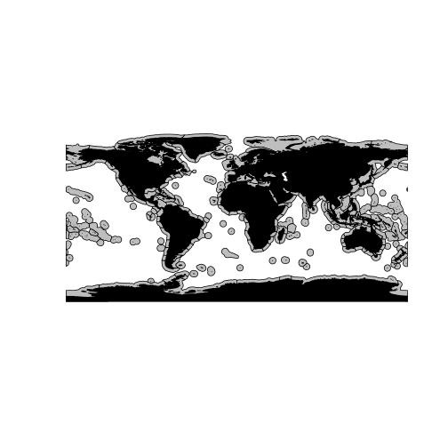 


Of course you could use specialized shapefiles at a much smaller scale if you wanted.


## Google Maps for terrain and satellite image based maps

Using Google Maps is a popular way to create a map using satellite imagery.  One of the first packages with this option was the "RgoogleMaps" package.  While it works just fine, I find it a bit clumsy to work with.  I currently prefer the mapping option in the "dismo" package. 

The dismo package by the way is also the package to use for *di*stribution *mo*delling (hence the name "dis mo").


```r
library(dismo)
```

```
## Loading required package: raster
```

```r

# Map of Oregon
OR_map <- gmap("Oregon", size = c(600, 600))
```

```
## Loading required package: XML
```

```r
plot(OR_map)
```

  

```r

# Road map of Portland
PDX_map <- gmap("Portland, OR", type = "roadmap")
plot(PDX_map)
```

 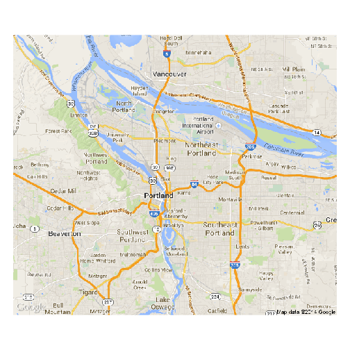 

```r
# That looks a bit blurry.  But we can interpolate..
plot(PDX_map, interpolate = TRUE)
```

  

```r

# Satellite map of Henry Hagg Lake
lake_map <- gmap("Henry Hagg Lake, Oregon", type = "satellite")
plot(lake_map, interpolate = TRUE)
```

 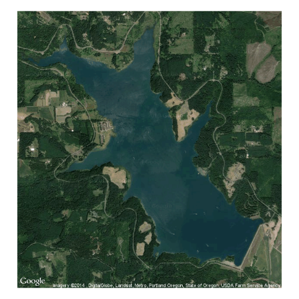 

```r

# Use the geocode() function to access the Google geocoding API to get point
# for PSU
PSU <- geocode(c("Portland State University"))

# The Map is a raster in Mercator projection so you need to transform the
# lat, lon data you want to plot over it.
PSU_coords <- Mercator(cbind(PSU$longitude, PSU$latitude))

plot(PDX_map, interpolate = TRUE)
```

 

```r
points(PSU_coords, col = "red", pch = 20)
```

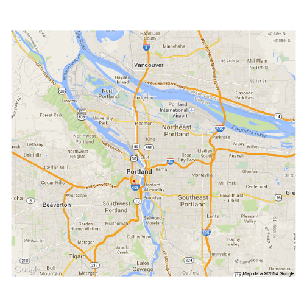 

```r

# The dismo package comes with a function that lets you pull down species
# data from the GBIF network of occurrence records

# Let's get some beaver data
beaver <- gbif("Castor", "canadensis", geo = TRUE)
```

```
## Castor canadensis : 1262 occurrences found
## 1-1000-1262
```

```r

# drop NA lat/lon data
beaver <- subset(beaver, !is.na(lat) & !is.na(lon))

# Transform the lat/lon to Mercator
beaver_coords <- Mercator(cbind(beaver$lon, beaver$lat))

# Calculate the extent of the beaver data
beaver_extent <- extent(c(min(beaver$lon), max(beaver$lon), min(beaver$lat), 
    max(beaver$lat)))

# Get a Google Map for that extent, plot it and then plot the beaver points
beaver_map <- gmap(beaver_extent, type = "satellite")
plot(beaver_map)
```

 

```r
points(beaver_coords, col = "red", pch = 20)
```

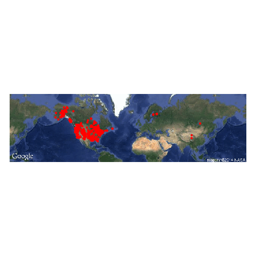 

```r

# Let's limit that beaver data to Oregon
or_beaver <- subset(beaver, adm1 == "Oregon")

# Transform the lat/lon to Mercator
or_beaver_coords <- Mercator(cbind(or_beaver$lon, or_beaver$lat))

# Plot the beaver occurrences onto a map of Oregon
plot(OR_map, interpolate = TRUE)
```

 

```r
points(or_beaver_coords, col = "red", pch = 20)
```

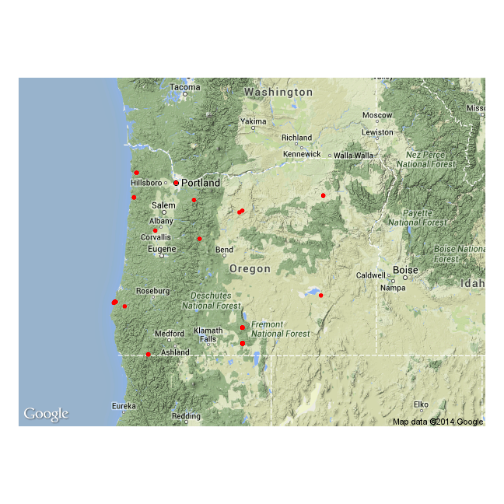 


## ggplot2 style plotting of maps

### Plotting a map in "ggplot2"" package


```r
library(ggplot2)

usamap <- ggplot() + borders("state") + theme_bw()

# Use cartesian coordinates
usamap
```

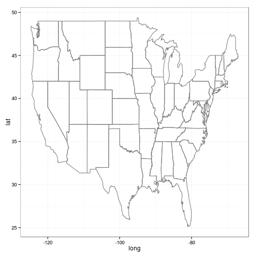 

```r
# With mercator projection
usamap + coord_map()
```

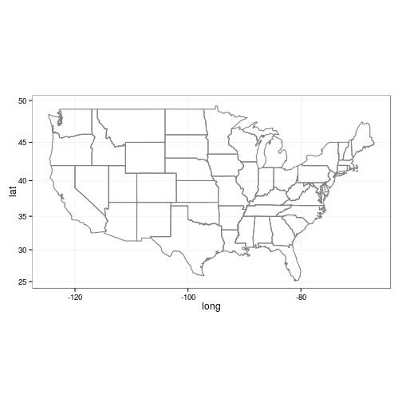 

```r
# See ?mapproject for coordinate systems and their parameters
usamap + coord_map("gilbert")
```

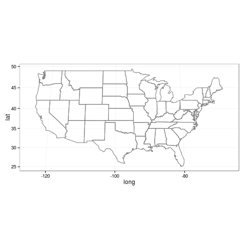 

```r
usamap + coord_map("tetra")
```

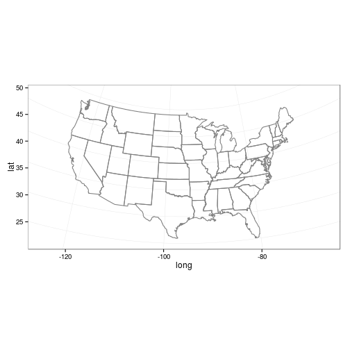 

### Plotting a shapefile in "ggplot2" package


```r
library(ggplot2)
library(gpclib)
```

```
## General Polygon Clipper Library for R (version 1.5-5)
## 	Type 'class ? gpc.poly' for help
```

```r
library(rgdal)
library(sp)
gpclibPermit()
```

```
## [1] TRUE
```

```r

dsn <- path.expand("~/Geoprocessing_Shapefiles")
world <- readOGR(dsn, "Countries")
```

```
## OGR data source with driver: ESRI Shapefile 
## Source: "/home/stevesb/Geoprocessing_Shapefiles", layer: "Countries"
## with 250 features and 8 fields
## Feature type: wkbPolygon with 2 dimensions
```

```r
world.fortify <- fortify(world, region = "CNTRY_NAME")
world.map <- ggplot(world.fortify, aes(long, lat, group = group)) + geom_polygon()
world.map
```

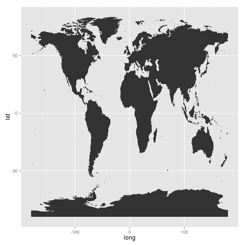 

```r

# a little odd
world.map + coord_equal()
```

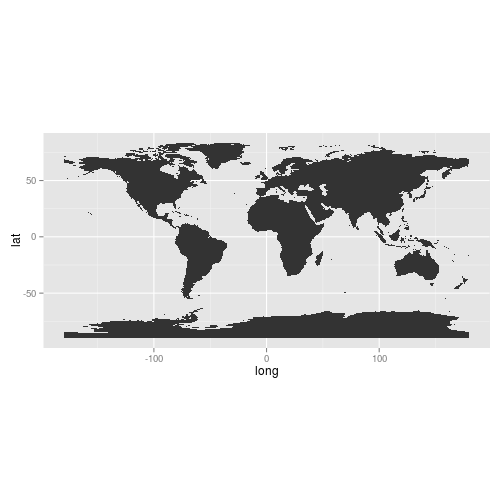 

```r
world.map + coord_map("gilbert")
```

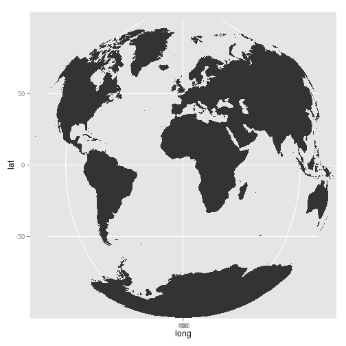 


## Issues with clipping when you zoom in on polygons in ggplot2


```r
library(PBSmapping)
```

```
## 
## -----------------------------------------------------------
## PBS Mapping 2.67.60 -- Copyright (C) 2003-2013 Fisheries and Oceans Canada
## 
## PBS Mapping comes with ABSOLUTELY NO WARRANTY;
## for details see the file COPYING.
## This is free software, and you are welcome to redistribute
## it under certain conditions, as outlined in the above file.
## 
## A complete user guide 'PBSmapping-UG.pdf' is located at 
## /home/stevesb/R/x86_64-pc-linux-gnu-library/3.1/PBSmapping/doc/PBSmapping-UG.pdf
## 
## Packaged on 2014-03-27
## Pacific Biological Station, Nanaimo
## 
## All available PBS packages can be found at
## http://code.google.com/p/pbs-software/
## 
## To see demos, type '.PBSfigs()'.
## -----------------------------------------------------------
```

```r
library(ggplot2)
library(maps)


# plot limits
xlim <- c(-140, -100)
ylim <- c(30, 50)

worldmap <- map_data("world")
names(worldmap) <- c("X", "Y", "PID", "POS", "region", "subregion")
worldmap2 <- clipPolys(worldmap, xlim = xlim, ylim = ylim, keepExtra = TRUE)

statemap <- map_data("state")
names(statemap) <- c("X", "Y", "PID", "POS", "region", "subregion")
statemap2 <- clipPolys(statemap, xlim = xlim, ylim = ylim, keepExtra = TRUE)

p <- ggplot() + coord_map(xlim = xlim, ylim = ylim) + geom_polygon(data = worldmap, 
    aes(X, Y, group = PID), fill = "darkseagreen", color = "grey50") + geom_polygon(data = statemap, 
    aes(X, Y, group = PID), fill = "darkseagreen", color = "grey50") + labs(y = "", 
    x = "") + theme_bw()
print(p)
```

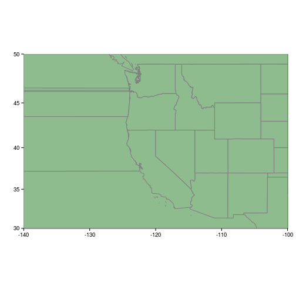 

```r


p2 <- ggplot() + coord_map(xlim = xlim, ylim = ylim) + geom_polygon(data = worldmap2, 
    aes(X, Y, group = PID), fill = "darkseagreen", color = "grey50") + geom_polygon(data = statemap2, 
    aes(X, Y, group = PID), fill = "darkseagreen", color = "grey50") + labs(y = "", 
    x = "") + theme_bw()
print(p2)
```

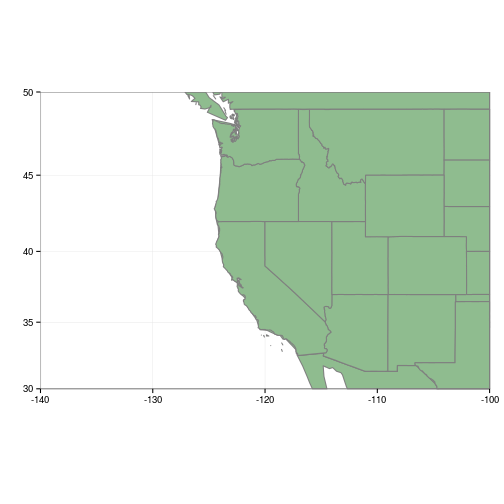 


### Plotting onto a Google Map in "ggmaps" package


```r
library(ggmap)
```

```
## 
## Attaching package: 'ggmap'
## 
## The following object is masked from 'package:dismo':
## 
##     geocode
```

```r
hhl <- get_map("Henry Hagg Lake", zoom = 14)
```

```
## Map from URL : http://maps.googleapis.com/maps/api/staticmap?center=Henry+Hagg+Lake&zoom=14&size=%20640x640&scale=%202&maptype=terrain&sensor=false
## Google Maps API Terms of Service : http://developers.google.com/maps/terms
## Information from URL : http://maps.googleapis.com/maps/api/geocode/json?address=Henry+Hagg+Lake&sensor=false
## Google Maps API Terms of Service : http://developers.google.com/maps/terms
```

```r
ggmap(hhl)
```

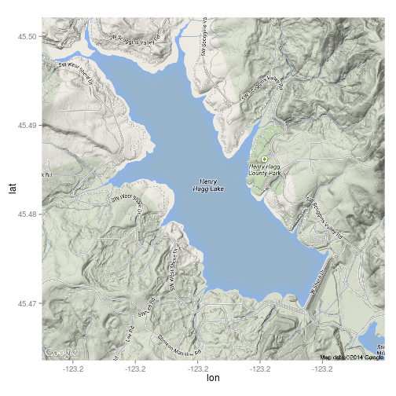 


## Advanced topics (GIS in R)

### Point in Polygon analysis


```r
# load sp package for 'over()' function
library(sp)
# turn beaver data.frame into a spatial data frame by setting coordinates
coordinates(beaver) <- c("lon", "lat")

# reload the countries shapefile from before
dsn <- path.expand("~/Geoprocessing_Shapefiles")
world <- readOGR(dsn, "Countries")
```

```
## OGR data source with driver: ESRI Shapefile 
## Source: "/home/stevesb/Geoprocessing_Shapefiles", layer: "Countries"
## with 250 features and 8 fields
## Feature type: wkbPolygon with 2 dimensions
```

```r

# set the projection of the beaver spatial data to the same as the countries
# shapefile
proj4string(beaver) <- proj4string(world)

# overlay beaver and world and return the 'CNTRY_NAME' for each beaver
# occurrence
overlay <- over(beaver, world)

# add this new CNTRY_NAME field to the beaver spatial data frame
beaver$CNTRY_NAME <- overlay$CNTRY_NAME


# Let's look to see where these beaver lat/lons are outside of the US and
# Canada
Non_NorthAmerican_Beavers <- subset(beaver, CNTRY_NAME != "USA" & CNTRY_NAME != 
    "Canada")

# Let's plot that
plot(world)
points(beaver, pch = 20, col = "blue")
points(Non_NorthAmerican_Beavers, pch = 20, col = "red")
```

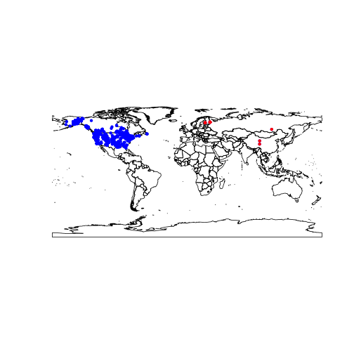 


